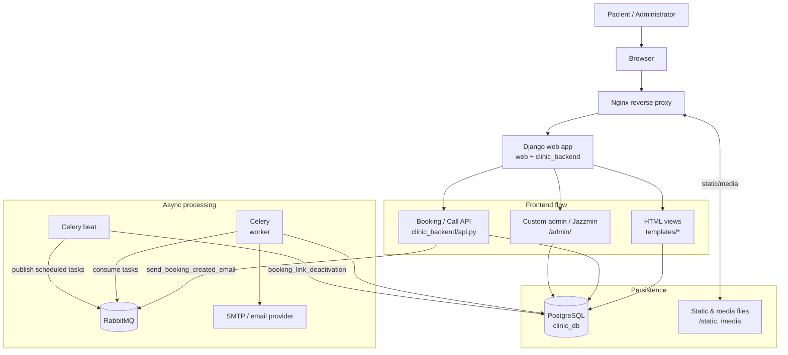

# ClinicWeb – Medical Booking & Staff Management System

Open-source version of a freelance project i was working on throughout my first semester of bachelor studies.<br>
<br>
Full-stack web application for managing clinic operations, including appointment scheduling, doctor availability, staff and patient management.

## 🚀 Features

- 📅 Appointment booking system with time-slot generation
- 👨‍⚕️ Doctor schedule & timetable management
- 🧑‍🤝‍🧑 Patient management system
- ✉️ Transactional email support
- ⚙️ Background task processing with Celery + RabbitMQ
- 🐳 Fully dockerized infrastructure
- 🔐 Authentication & admin panel

## 🌐 Live Demo
Production deployment: https://sventus.ru  


## 🏗️ Architecture

The project is built as a containerized multi-service system:

- **Backend**: Django (REST API)
- **Database**: PostgreSQL
- **Task Queue**: Celery + RabbitMQ
- **Reverse Proxy**: Nginx
- **Containerization**: Docker & Docker Compose

Services communicate via internal Docker network.

## 📊 Architecture Diagram


## 📦 Tech Stack

- Python / Django
- PostgreSQL
- Celery / RabbitMQ
- Docker / Docker Compose
- Nginx
- CD / GitHub Actions
  
## ⚡ Getting Started

### Prerequisites

Before running the project, make sure you have installed:

- Docker
- Docker Compose

### 1. Clone the repository

```bash
git clone https://github.com/yourusername/clinicweb.git
cd clinicweb
```

### 2. Configure environment variables

Create a `.env` file in the project root:

```bash
cp .env.example .env
```

### 3. Start the application

```bash
docker compose up --build
```

### 4. Run migrations

```bash
docker compose exec clinic_backend python manage.py migrate
```

### 5. Create admin user

```bash
docker compose exec clinic_backend python manage.py createsuperuser
```

### 6. Collect static files

```bash
docker compose exec clinic_backend python manage.py collectstatic --noinput
```

### 7. Access the application

- **Main app:** http://localhost
- **Admin panel:** http://localhost/admin
- **pgAdmin:** http://localhost:8888

### 8. Stop the containers

```bash
docker compose down
```

## 👤 Author

Fedor Maleev

- GitHub: https://github.com/MaleevFedor
- LinkedIn: https://www.linkedin.com/in/fedormaleev/
